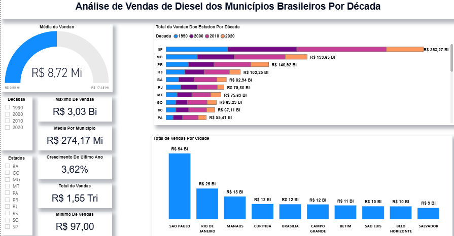

# ⛽ Análise de Vendas de Diesel nos Municípios Brasileiros

### Visão Geral do Projeto

---

## 📌 Objetivo

Este projeto tem o intuito de **analisar as vendas de óleo diesel nos municípios brasileiros** entre as décadas de 1990 e 2023.
A análise foi realizada no **Power BI**, utilizando medidas em **DAX**, permitindo identificar padrões de consumo, crescimento anual, participação regional e desigualdades no mercado de diesel.

---

## 📊 Métricas Desenvolvidas

Foram criadas medidas em **DAX** para responder a perguntas de negócio relevantes:

* **Média de Vendas (Geral):** valor médio vendido em todo o conjunto de dados.
* **Média por Município:** média considerando cada município individualmente.
* **Máximo de Vendas:** maior volume registrado em um único município/ano.
* **Mínimo de Vendas (desconsiderando zeros):** menor volume positivo registrado.
* **Total de Vendas:** soma de todas as vendas no período analisado.
* **Crescimento do Último Ano (%):** variação percentual em relação ao ano anterior.
* **Total de Vendas por Estado e Década:** análise histórica regional.
* **Total de Vendas por Cidade:** ranking comparativo entre municípios.

---

## 🛠️ Ferramentas Utilizadas

* **Power BI** → construção de dashboards e visualizações interativas.
* **DAX** → desenvolvimento de medidas e cálculos comparativos.
* **GitHub** → versionamento e documentação do projeto.

---

## 🔍 Principais Insights

### 1️⃣ Concentração Regional

* As vendas de diesel estão **altamente concentradas em poucos municípios**.
* **São Paulo, Rio de Janeiro e Manaus** se destacam como grandes polos econômicos e industriais, com São Paulo liderando tanto o ranking de **estado** quanto de **cidade**.

**Ranking por Estado:**

**Ranking por Cidade:**

---

### 2️⃣ Tendência Histórica

* A análise por **décadas** mostra uma **tendência de aumento constante** das vendas de diesel, com destaque para os estados do **Sudeste** e **Sul**.

---

### 3️⃣ Desigualdade entre Regiões

* Municípios do **interior** registram vendas muito baixas (próximas de zero), enquanto capitais e grandes polos econômicos concentram volumes extremamente altos.
* Existe uma clara concentração nas **macrorregiões Sul e Sudeste**.
* No **Nordeste**, a **Bahia** é exceção, apresentando volume de vendas significativamente maior do que outros estados da região.

---

## ✅ Conclusão

A análise evidencia que o mercado de diesel no Brasil é **desigualmente distribuído**, fortemente concentrado em grandes centros urbanos e regiões mais industrializadas.
Essas informações podem apoiar **planejamento logístico, políticas energéticas e estratégias de distribuição** no setor.

---

## 🔗 Fontes de Dados

* [Dados Abertos do Governo - Vendas de Derivados de Petróleo e Biocombustíveis](https://dados.gov.br/dados/conjuntos-dados/vendas-de-derivados-de-petroleo-e-biocombustiveis)

---

## 🎬 Demonstração do Dashboard

---
